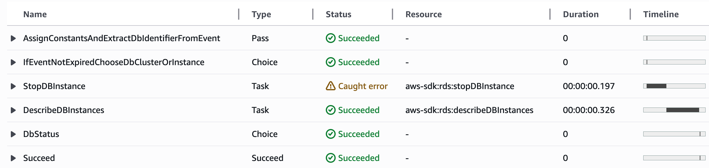
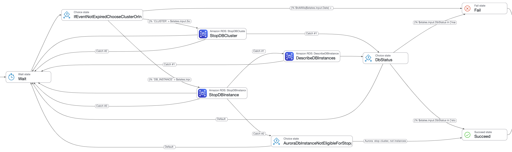

# Step-Stay Stopped, RDS and Aurora!

_Keep AWS databases stopped when not needed, with a Step Function_

## Purpose

This is a low-code, Step Function-based alternative to my Lambda-based tool for
stopping RDS and Aurora databases that AWS has automatically started after the
7-day maximum stop period. Both use the same reliable process, free of
[race conditions](https://github.com/sqlxpert/stay-stopped-aws-rds-aurora#perspective)
that might leave databases running without warning.

Jump to:
[Get Started](#get-started)
&bull;
[Multi-Account, Multi-Region](#multi-account-multi-region)
&bull;
[Terraform](#terraform)
&bull;
[Security](#security)

### Diagram

Click to view the simplified flowchart:

[](media/stay-stopped-aws-rds-aurora-flow-simple.png?raw=true "Simplified flowchart for [Step-]Stay Stopped, RDS and Aurora!")

### Use Cases

- testing
- development
- infrequent reference
- old databases kept just in case
- vacation or leave beyond one week

If it would cost too much to keep a database running but take too long to
re-create it, this tool might save you money, time, or both. AWS does not
charge for database instance hours while an
[RDS database instance is stopped](https://docs.aws.amazon.com/AmazonRDS/latest/UserGuide/USER_StopInstance.html#USER_StopInstance.Benefits)
or an
[Aurora database cluster is stopped](https://docs.aws.amazon.com/AmazonRDS/latest/AuroraUserGuide/aurora-cluster-stop-start.html#aurora-cluster-start-stop-overview).
(Other charges, such as for storage and snapshots, continue.)

## Comparison

||Step Function (here)|Lambda|
|---:|:---:|:---:|
|github.com/sqlxpert/|[**step**-stay-stopped-aws-rds-aurora](/../../#step-stay-stopped-rds-and-aurora)|[stay-stopped-aws-rds-aurora](https://github.com/sqlxpert/stay-stopped-aws-rds-aurora#stay-stopped-rds-and-aurora)|
|[EventBridge rule](https://docs.aws.amazon.com/eventbridge/latest/userguide/eb-rules.html) target|Step Function|SQS&nbsp;queue, which feeds a Lambda&nbsp;function|
|Lines of code|**&lt;&nbsp;200** JSON/[JSONata](https://docs.jsonata.org) lines|**&gt;&nbsp;300** Python lines|
|Main file|[step_stay_stopped_aws_rds_aurora.asl.json](/step_stay_stopped_aws_rds_aurora.asl.json)|[stay_stopped_aws_rds_aurora.py](https://github.com/sqlxpert/stay-stopped-aws-rds-aurora/blob/main/stay_stopped_aws_rds_aurora.py)|
|Installation template|[step_stay_stopped_aws_rds_aurora.yaml](/step_stay_stopped_aws_rds_aurora.yaml)|[stay_stopped_aws_rds_aurora.yaml](https://github.com/sqlxpert/stay-stopped-aws-rds-aurora/blob/main/stay_stopped_aws_rds_aurora.yaml)|
|API calls|[AWS SDK integration](https://docs.aws.amazon.com/step-functions/latest/dg/supported-services-awssdk.html)|[boto3 RDS client](https://boto3.amazonaws.com/v1/documentation/api/latest/reference/services/rds.html)|
|Decisions and branching|[Choice states](https://docs.aws.amazon.com/step-functions/latest/dg/state-choice.html)|Python control flow statements|
|Error handling|[Catchers](https://docs.aws.amazon.com/step-functions/latest/dg/concepts-error-handling.html#error-handling-fallback-states) on task states|`try`...`except`|
|Retry mechanism|[Wait state](https://docs.aws.amazon.com/step-functions/latest/dg/state-wait.html)|[Queue message [in]visibility&nbsp;timeout](https://docs.aws.amazon.com/AWSSimpleQueueService/latest/SQSDeveloperGuide/sqs-visibility-timeout.html)|
|Initial delay mechanism|Same wait&nbsp;state, entered&nbsp;immediately|[First-time delivery&nbsp;delay](https://docs.aws.amazon.com/AWSSimpleQueueService/latest/SQSDeveloperGuide/sqs-delay-queues.html)|
|Timeout mechanism|[State machine TimeoutSeconds](https://docs.aws.amazon.com/step-functions/latest/dg/statemachine-structure.html#statemachinetimeoutseconds)|[maxReceiveCount](https://docs.aws.amazon.com/AWSSimpleQueueService/latest/SQSDeveloperGuide/sqs-dead-letter-queues.html#policies-for-dead-letter-queues)|

<details>
  <summary>If you have time, don't miss: Step Function advantages and disadvantages...</summary>

### Step Function Advantages

#### 1. Faster development, testing and debugging

Quite frankly, it is a miracle that **fewer than 200 lines of JSON can replace
more than 300 lines of executable Python** code. Development is significantly
faster, whether you add states visually or you compose or edit the JSON code
manually.

Testing and debugging are moderately faster. Although a correct state machine,
able to handle error conditions, is liable to be more complex than the
initial, normal-case design, even a complex state machine diagram becomes
readable when the Step Functions console marks it up with the traversal from a
particular run. Click below to view an example. Next, click for the "State
view", a tabular summary. Not shown is the "Event view", a complete log of the
payload at the start and end of each state, plus data available for use within
the scope of one state (such as an API response).

[](media/step-function-debug-flow-follow-true.png?raw=true "Automatically-generated Step Function state machine execution diagram")

[](media/step-function-debug-list.png?raw=true "Step Function state machine execution state list view")

This example shows an idempotence test: trying to stop an RDS database instance
that was already stopping or stopped.

#### 2. Less maintenance

Clearly, Step Functions require less maintenance. Although Step Functions may
call AWS Lambda functions, many problems can be solved without recourse to
Lambda, so that there is no software to patch &mdash; not even a runtime to
update every few months.

#### 3. Even lower compute cost

Step Functions are perfect for processes that require lots of wall-clock time
but little actual computing time, such as waiting for a database to start and
then seeing a stop request through until the database is stopped again.
The
[Step Function standard mode price is 25&cent; per 10,000 transitions](https://aws.amazon.com/step-functions/pricing/#AWS_Step_Functions_Standard_Workflow_State_transitions_pricing)
(arrows traversed, on the state machine diagram), regardless of time spent
(the pricing basis for AWS Lambda). To put this in perspective, if we ignore
negligible numbers of startup and shutdown transitions, a cycle of 4 (Aurora)
or 5 (RDS) state transitions repeats every 9 minutes from the time AWS starts a
database until the database is stopped again.

Step Function logs tend to be noisier, as explained below, so volume-sensitive
logging costs could be higher.

Prices vary by region, and might change.

### Step Function Disadvantages

#### 1. Inconsistent error names

These inconsistencies are bugs waiting to happen. Here are two key
StopDBInstance errors:

||Cannot Be Stopped Now|Cannot Be Stopped Ever|
|---:|:---|:---|
|Dynamic boto3 exception: `Client("rds").exceptions.`|[`InvalidDBInstanceStateFault`](https://boto3.amazonaws.com/v1/documentation/api/latest/reference/services/rds/client/stop_db_instance.html)||
|Static boto3 [ClientError](https://boto3.amazonaws.com/v1/documentation/api/latest/guide/error-handling.html#parsing-error-responses-and-catching-exceptions-from-aws-services) exception `Code`|`InvalidDBInstanceState`|`InvalidParameterCombination`|
|AWS API error|[`InvalidDBInstanceState`](https://docs.aws.amazon.com/AmazonRDS/latest/APIReference/API_StopDBInstance.html#API_StopDBInstance_Errors)||
|Step Function `ErrorEquals` match: `Rds.`|`InvalidDbInstanceStateException`|`RdsException`|

There is even a
[special note about the `Exception` suffix](https://docs.aws.amazon.com/step-functions/latest/dg/supported-services-awssdk.html#use-awssdk-integ)!

#### 2. Rudimentary retries

[boto3 can retry automatically](https://boto3.amazonaws.com/v1/documentation/api/latest/guide/retries.html#standard-retry-mode)
in response to 18 exceptions and 4 general HTTP status codes. You'd have to
experiment to discover the Step Function service's name for each of the 22
error conditions (there is no comprehensive document), list all 22 in the
`ErrorEquals` field of the
[retrier](https://docs.aws.amazon.com/step-functions/latest/dg/concepts-error-handling.html#error-handling-retrying-after-an-error),
and then duplicate the list in every state that makes an AWS API request.
That's just not practical.

Thankfully, stopping an RDS or Aurora database is a watch-and-wait operation.
Natural retries with long pauses in between make it unnecessary to match
boto3's diligent retry logic, meant more for single, critical AWS API calls.

#### 3. Less logging control

Logs should be kept clear so that critical problems stand out, if the fable
[The Boy Who Cried Wolf](https://en.wikipedia.org/wiki/The_Boy_Who_Cried_Wolf),
the saying "All emphasis is no emphasis",
and the
[Three Mile Island nuclear accident](https://en.wikipedia.org/wiki/Three_Mile_Island_accident)
are any guide.

> The computer printer registering alarms was running more than 2&frac12; hours
behind the events and at one point jammed, thereby losing valuable information.

<details>
  <summary>Reference...</summary>

- _Report of the President's Commission on the Accident at Three Mile Island_,
  October, 1979, Page 30
- Direct link:
  [archive.org](https://archive.org/details/three-mile-island-report/page/30/mode/1up)
- Backup:
  [US Department of Energy Office of Scientific and Technical Information](https://www.osti.gov/biblio/6986994)
- In the backup source, "2&frac12; hours" was mis-scanned as "2-k hours", an
  error that has been repeated as "2000 hours" in at least one book. The
  printer backlog did not reach 83 days; 2&frac12; hours was bad enough!

</details>

The Step Function service logs any exception at the `ERROR` level. I cannot
choose to log expected exceptions (such as InvalidDBClusterState when calling
StopDBCluster while an Aurora database is `starting` and while it's `stopping`)
at the `INFO` level and spare the `ERROR` level for exceptions that require
attention.

In fact,
[Step Function log levels](https://docs.aws.amazon.com/step-functions/latest/dg/cw-logs.html#cloudwatch-log-level)
skip directly from `ALL` to `ERROR`. Without an `INFO` level, it's impossible
to log successful database stop operations without throwing in `DEBUG`-level
details too.

#### 4. Complex diagrams

Reliably re-stopping an RDS or Aurora database &mdash; that is, avoiding
[race conditions](https://github.com/sqlxpert/stay-stopped-aws-rds-aurora#perspective)
that might leave the database running at your expense, without warning you
&mdash; is a complex process. The Step Functions console generates hard-to-read
diagrams with tiny text, truncated labels, and unnecessary cross-overs. A
diagram's explanatory value falls off as soon as you add error-handling logic
to your state machine. This is more a missed opportunity than a disadvantage.
Other services give you no diagram, so you have to make your own. The Step
Functions console gives you a bad diagram that you can't edit, so you still
have to make your own.

Compare:

[](media/step-stay-stopped-aws-rds-aurora-flow-auto-follow-true.png?raw=true "Automatically-generated state machine diagram for the Amazon Web Services Step Function solution")
[](media/stay-stopped-aws-rds-aurora-architecture-and-flow.png?raw=true "Custom architecture diagram and flowchart for the Amazon Web Services Lambda solution")

### The Step Function Wins!

**The advantages of a Step Function far outweigh the disadvantages.** If you
take the time to understand the _semantics_ of AWS APIs and build appropriate
error-handling logic into your state machine &mdash; in other words, if your
solution is _correct_ &mdash; then a compact, predominantly declarative
implementation with a graphical representation cuts development time,
simplifies testing, and reduces maintenance effort.

AWS is actively improving the service. For example, the
[transition from JSONPath to JSONata](https://aws.amazon.com/blogs/compute/simplifying-developer-experience-with-variables-and-jsonata-in-aws-step-functions/),
begun in 2024, has significantly increased the declarative capabilities of Step
Functions. It's possible that some of the disadvantages I noticed will be
addressed in the future.

### Step Function Clarity

Given the complexity of correct error-handling logic, and the weaknesses of the
Step Function console's automatically-generated diagrams, it's important to
document and explain your state machine. Here is my advice:

 1. Choose descriptive state names. For example, I changed `Dispatch` to
    `IfEventNotExpiredChooseClusterOrInstance`.

 2. Append a question mark (`?`) to the name of a straightforward binary Choice
    state.

 3. Include the same root word(s) in a related AWS API method name, AWS API
    method parameter name, AWS resource name, ARN component, state machine
    variable name, JSONanata variable name, state `Output` key, state name,
    `ErrorEquals` error name, and/or CloudFormation substitution parameter
    name.

 4. Front-load distinguishing information to guard against truncation in
    state machine diagrams. For example, the important information in this pair
    of Boolean expressions for Choice state rules comes first:
    - `'available' = states.input.DbStatus`
    - `'stopping' = states.input.DbStatus`

 5. Don't add `Comment` keys or `/* JSONata comments */` if the information is
    obvious from the state name, a Boolean expression in a Choice rule, an
    `ErrorEquals` error name, or some other proximate clue.
    - As of June, 2025, the Step Function console labels Choice rule branches
      with `Comment` values, but numbers Catch branches even if they have
      comments.
    - Add a comment if a term cannot be used in searches. Search features don't
      allow, or don't do a good job with: symbols; the definite article "the";
      other short "stop-words"; and words with two or more popular meanings.
      For example, without the comment, this JSONata expression:

      ```jsonata
      $states.input ~> |$|{}, ['Error', 'Cause']| /* https://docs.jsonata.org/other-operators#-------transform */
      ```

      would give no clue about what to search for. It is impossible to search
      for `|` or `$`, and probably for `~>` too. I would make sure at least one
      occurrence received a comment.

 6. Although a JSON object's keys form a set, and sets are unordered, changing
    the order of the keys in a state machine's JSON definition code after the
    fact will make the definition easier for other people to understand. I like
    to place the `States` keys in temporal order. Within each state object
    and any nested objects, I like to place the keys in the order in which they
    will be referenced.
    - A logical order would be:<br/>
      `Type`;<br/>
      `Choices`, or `Resource`, `Arguments`, and `TimeoutSeconds`, or
      `Catch`;<br/>
      `Condition` or `ErrorEquals`;<br/>
      `Variables`, `Output`, and `Next`.
    - A `Comment`, if needed, should go above, between or below the keys it
      describes.
    - If similar objects are repeated, put the keys whose values distinguish
      the objects near the top. Draw attention to differences.

 7. Don't hesitate to add extra Pass and Choice states so that the state names
    themselves explain discrete steps in a process. (Minimize the number of
    state transitions in cycles that will be traversed many times. In standard
    mode, AWS charges per state transition.)

</details>

## Get Started

 1. Log in to the AWS Console as an administrator. Choose an AWS account and a
    region where you have an RDS or Aurora database that is normally stopped,
    or that you can stop now and leave stopped for 8 days.

 2. If you used Stay-Stopped, the original, AWS Lambda-based variant,
    - Delete your standalone `StayStoppedRdsAurora` CloudFormation _stack_, or
    - Delete your `StayStoppedRdsAurora` CloudFormation _StackSet_, or set the
      `Enable` parameter to "false" and then deploy the change to all existing
      targets.

 3. Create a
    [CloudFormation stack](https://console.aws.amazon.com/cloudformation/home)
    "With new resources (standard)". Select "Upload a template file", then
    select "Choose file" and navigate to a locally-saved copy of
    [step_stay_stopped_aws_rds_aurora.yaml](/step_stay_stopped_aws_rds_aurora.yaml?raw=true)
    [right-click to save as...]. On the next page, set:

    - Stack name: `StepStayStoppedRdsAurora`

 4. Wait 8 days, then check that your
    [RDS or Aurora database](https://console.aws.amazon.com/rds/home#databases:)
    is stopped. After clicking the RDS database instance name or the Aurora
    database cluster name, open the "Logs & events" tab and scroll to "Recent
    events". At the right, click to change "Last 1 day" to "Last 2 weeks". The
    "System notes" column should include the following entries, listed here
    from newest to oldest. There might be other entries in between.

    |RDS|Aurora|
    |:---|:---|
    |DB instance stopped|DB cluster stopped|
    |DB instance started|DB cluster started|
    |DB instance is being started due to it exceeding the maximum allowed time being stopped.|DB cluster is being started due to it exceeding the maximum allowed time being stopped.|

    > If you don't want to wait 8 days, see
    [Testing](#testing),
    below.

## Multi-Account, Multi-Region

For reliability, Step-Stay-Stopped works independently in each region, in each
AWS account. To deploy in multiple regions and/or multiple AWS accounts,

 1. Delete any standalone `StepStayStoppedRdsAurora` CloudFormation _stacks_ in
    your target regions and/or AWS accounts.

 2. If you used Stay-Stopped, the original, AWS Lambda-based variant,
    - Delete any standalone `StayStoppedRdsAurora` CloudFormation _stacks_, or
    - Delete your `StayStoppedRdsAurora` CloudFormation _StackSet_, or set the
      `Enable` parameter to "false" and then deploy the change to all existing
      targets.

 3. Complete the prerequisites for creating a _StackSet_ with
    [service-managed permissions](https://docs.aws.amazon.com/AWSCloudFormation/latest/UserGuide/stacksets-orgs-enable-trusted-access.html).

 4. In the management AWS account (or a delegated administrator account),
    create a
    [CloudFormation StackSet](https://console.aws.amazon.com/cloudformation/home#/stacksets).
    Select "Upload a template file", then select "Choose file" and upload a
    locally-saved copy of
    [step_stay_stopped_aws_rds_aurora.yaml](/step_stay_stopped_aws_rds_aurora.yaml?raw=true)
    [right-click to save as...]. On the next page, set:

    - StackSet name: `StepStayStoppedRdsAurora`

 5. Two pages later, under "Deployment targets", select "Deploy to
    Organizational Units". Enter your target `ou-` identifier.
    Step-Stay-Stopped will be deployed in all AWS accounts in your target OU.
    Toward the bottom of the page, specify your target region(s).

## Terraform

Terraform users are often willing to wrap a CloudFormation stack in HashiCorp
Configuration Language, because AWS supplies tools in the form of
CloudFormation templates. See
[aws_cloudformation_stack](https://registry.terraform.io/providers/hashicorp/aws/latest/docs/resources/cloudformation_stack)
.

Wrapping a CloudFormation StackSet in HCL is much easier than configuring and
using Terraform to deploy and maintain identical resources in multiple regions
and/or AWS accounts. See
[aws_cloudformation_stack_set](https://registry.terraform.io/providers/hashicorp/aws/latest/docs/resources/cloudformation_stack_set)
.

## Security

> In accordance with the software license, nothing in this document establishes
indemnification, a warranty, assumption of liability, etc. Use this software
entirely at your own risk. You are encouraged to review the source code.

<details>
  <summary>Security details...</summary>

### Security Design Goals

- A least-privilege role for the AWS Step Function.

- A Step Function role that cannot be used by arbitrary functions. If the role
  is passed to an arbitrary Step Function, Task states will not gain access to
  the Aurora and RDS API.

- A least-privilege queue policy. The error (dead letter) queue can only
  consume messages from EventBridge. Encryption in transit is required.

- Optional encryption at rest with the AWS Key Management System, for the
  error queue, Step Function state machine payloads, and the log. This can
  protect EventBridge events containing database identifiers and metadata, such
  as tags. KMS keys housed in a different AWS account, and multi-region keys,
  are supported.

- A retry mechanism and a state machine timeout, to increase the likelihood
  that a database will be stopped as intended but prevent endless retries.

- A 24-hour event date/time expiry check, to prevent processing of accumulated
  stale events, if any.

- Readable Identity and Access Management policies, formatted as CloudFormation
  YAML rather than JSON (where permitted), and broken down into discrete
  statements by service, resource or principal.

### Your Security Steps

- Prevent people from modifying components of this tool, most of which can be
  identified by `StepStayStoppedRdsAurora` in ARNs and in the automatic
  `aws:cloudformation:stack-name` tag.

- Log infrastructure changes using CloudTrail, and set up alerts.

- Prevent people from directly invoking the Step Function.

- Separate production workloads. Although this tool only stops databases that
  _AWS_ is starting after they've been stopped for 7 days, the Step Function
  could stop _any_ database if invoked directly, with a contrived event as
  input. You might choose not to deploy this tool in AWS accounts used for
  production, or you might add a custom IAM policy to the function role,
  denying authority to stop certain production databases (`AttachLocalPolicy`
  in CloudFormation).

  - Tagging an RDS database instance or an Aurora database cluster with
    `StayStopped-Exclude` (see `ExcludeTagKey` in CloudFormation) prevents the
    Step Function role from being misused to stop that database.
    &#9888; Do not rely on
    [attribute-based access control](https://docs.aws.amazon.com/IAM/latest/UserGuide/introduction_attribute-based-access-control.html)
    unless you also prevent people and systems from adding, changing and
    deleting ABAC tags.

- Enable the test mode only in a non-critical AWS account and region, and turn
  the test mode off again as quickly as possible.

- Monitor the error (dead letter) queue, and monitor the log.

- Configure [budget alerts](https://docs.aws.amazon.com/cost-management/latest/userguide/budgets-action-configure.html)
  and use
  [cost anomaly detection](https://docs.aws.amazon.com/cost-management/latest/userguide/manage-ad.html).

- Occasionally start a database before its maintenance window and leave it
  running, to catch up with RDS and Aurora security updates.

</details>

## Troubleshooting

Check the:

 1. [StepStayStoppedRdsAurora-StepFn CloudWatch log group](https://console.aws.amazon.com/cloudwatch/home#logsV2:log-groups$3FlogGroupNameFilter$3DStepStayStoppedRdsAurora-StepFn)
    - `Rds.InvalidDbInstanceStateException` or
      `Rds.InvalidDbClusterStateException` errors, with no other proximate
      errors, are expected and can be ignored.
    - Log entries are JSON objects.
    - For more data, change the `LogLevel` in CloudFormation.

 2. "Executions" data for the `StepStayStoppedRdsAurora-StepFn`
    [Step Function](https://console.aws.amazon.com/states/home#/statemachines)
    - The "State view" is useful for diagnosing errors.
    - Rows with "Caught error" in the "Status" column are expected and can be
      ignored if the "Reason" is `Rds.InvalidDbInstanceStateException` or
      `Rds.InvalidDbClusterStateException`&nbsp.

 3. `StepStayStoppedRdsAurora-ErrorQueue` (dead letter)
    [SQS queue](https://console.aws.amazon.com/sqs/v3/home#/queues)
    - A message here means that the Step Function did not run; the request to
      stop the database was not made.
    - Usually the local security configuration is denying EventBridge necessary
      access to the Step Function.

 4. [CloudTrail Event history](https://console.aws.amazon.com/cloudtrailv2/home?ReadOnly=false/events#/events?ReadOnly=false)
    - CloudTrail events with an "Error code" may indicate permissions
      problems,
      typically due to the local security configuration.
    - To see more events, change "Read-only" from `false` to `true` .

## Testing

<details>
  <summary>Testing details...</summary>

### Recommended Test Database

An RDS database instance ( `db.t4g.micro` , `20` GiB of gp3 storage, `0` days'
worth of automated backups) is cheaper than a typical Aurora cluster, not to
mention faster to create, stop, and start.

### Test Mode

AWS starts RDS and Aurora databases that have been stopped for 7 days, but we
need a faster mechanism for realistic, end-to-end testing. Temporarily change
these parameters in CloudFormation:

|Parameter|Normal|Test|
|:---|:---:|:---:|
|`Test`|`false`|`true`|
|`LogLevel`|`ERROR`|`ALL`|
|`StepFnWaitSeconds`|`540`|`60`|
|&rarr; _Equivalent in minutes_|_9 minutes_|_1 minute_|
|`StepFnTimeoutSeconds`|`86400`|`1800`|
|&rarr; _Equivalent in hours_|_24 hours_|_&frac12; hour_|

**&#9888; Exit test mode as quickly as possible**, given the operational and
security risks explained below. If your test database is ready, several minutes
should be sufficient.

### Test by Manually Starting a Database

In test mode, Step-Stay-Stopped responds to user-initiated, non-forced database
starts, too:
[RDS-EVENT-0088 (RDS database instance)](https://docs.aws.amazon.com/AmazonRDS/latest/UserGuide/USER_Events.Messages.html#RDS-EVENT-0088)
and
[RDS-EVENT-0151](https://docs.aws.amazon.com/AmazonRDS/latest/AuroraUserGuide/USER_Events.Messages.html#USER_Events.Messages.cluster)
(Aurora database cluster). Although it won't stop databases that are already
running and remain running, **&#9888; while in test mode Step-Stay-Stopped will
stop databases that you start manually**. To test, manually
start a stopped
[RDS or Aurora database](https://console.aws.amazon.com/rds/home#databases:).

> In test mode, Step-Stay-Stopped also receives
[RDS-EVENT-0088 (Aurora database instance)](https://docs.aws.amazon.com/AmazonRDS/latest/AuroraUserGuide/USER_Events.Messages.html#RDS-EVENT-0088).
Internally, the code ignores it in favor of the cluster-level event.

### Test by Invoking the Step Function

Depending on locally-determined permissions, you may also be able to invoke
the `StepStayStoppedRdsAurora-StepFn`
[Step Function](https://console.aws.amazon.com/states/home#/statemachines)
manually. Edit the database names and date/time strings (must be within the
past `StepFnTimeoutSeconds` and end in `Z` for
[UTC](https://www.timeanddate.com/worldclock/timezone/utc))
in these test inputs:

```json
{
  "detail": {
    "SourceIdentifier": "Name-Of-Your-RDS-Database-Instance",
    "Date": "2025-06-06T04:30Z",
    "SourceType": "DB_INSTANCE",
    "EventID": "RDS-EVENT-0154"
  },
  "detail-type": "RDS DB Instance Event",
  "source": "aws.rds",
  "version": "0"
}
```

```json
{
  "detail": {
    "SourceIdentifier": "Name-Of-Your-Aurora-Database-Cluster",
    "Date": "2025-06-06T04:30Z",
    "SourceType": "CLUSTER",
    "EventID": "RDS-EVENT-0153"
  },
  "detail-type": "RDS DB Cluster Event",
  "source": "aws.rds",
  "version": "0"
}
```

### Report Bugs

After following the
[troubleshooting](#troubleshooting)
steps and ruling out local issues such as permissions &mdash; especially
hidden controls such as Service and Resource control policies (SCPs and RCPs)
&mdash; please
[report bugs](/../../issues). Thank you!

</details>

## Licenses

|Scope|Link|Included Copy|
|:---|:---|:---|
|Source code, and source code in documentation|[GNU General Public License (GPL) 3.0](http://www.gnu.org/licenses/gpl-3.0.html)|[LICENSE-CODE.md](/LICENSE-CODE.md)|
|Documentation, including this ReadMe file|[GNU Free Documentation License (FDL) 1.3](http://www.gnu.org/licenses/fdl-1.3.html)|[LICENSE-DOC.md](/LICENSE-DOC.md)|

Copyright Paul Marcelin

Contact: `marcelin` at `cmu.edu` (replace "at" with `@`)
