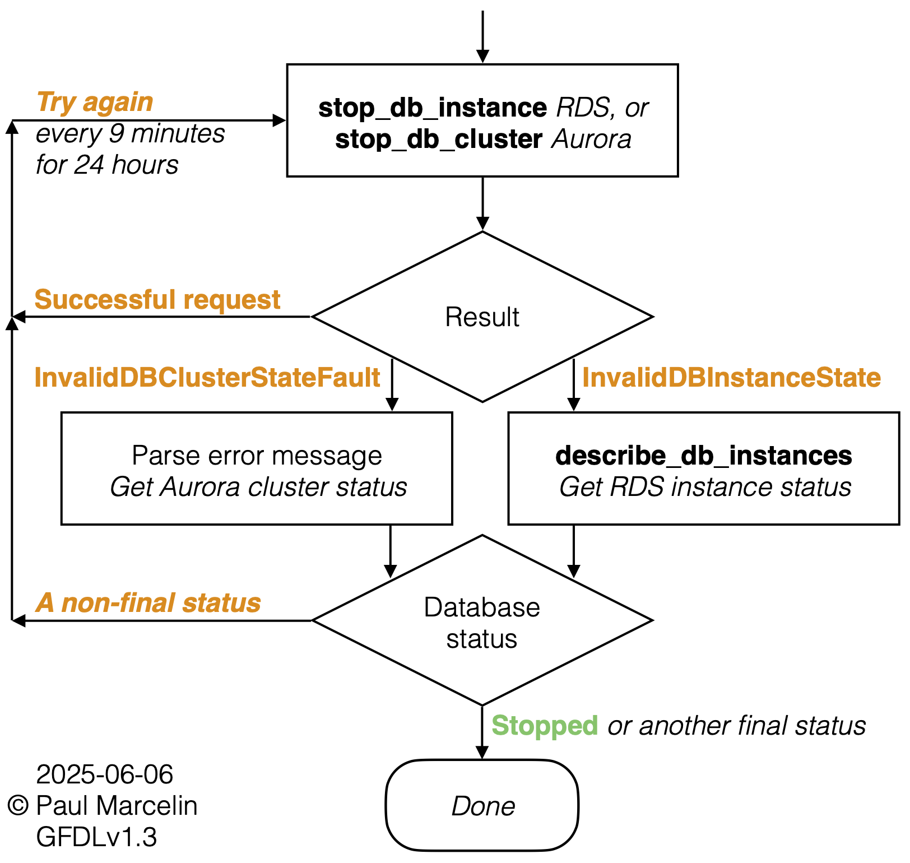

# Step-Stay Stopped, RDS and Aurora!

_Reliably keep AWS databases stopped when not needed_

## Purpose

This is the low-code, Step&nbsp;Function-based replacement for my original
Lambda-based tool for stopping RDS and Aurora databases that AWS has
automatically started after the 7-day maximum stop period. Both use the same
reliable process, free of
[race conditions](https://github.com/sqlxpert/stay-stopped-aws-rds-aurora#perspective)
that might leave databases running without warning.

Jump to:
[Get Started](#get-started)
&bull;
[Multi-Account, Multi-Region](#multi-account-multi-region)
&bull;
[Security](#security)

### Diagram

Click to view the simplified flowchart:

[](media/stay-stopped-aws-rds-aurora-flow-simple.png?raw=true "Simplified flowchart for [Step-]Stay Stopped, RDS and Aurora!")

### Use Cases

- testing
- development
- infrequent reference
- old databases kept just in case
- vacation or leave beyond one week

If it would cost too much to keep a database running but take too long to
re-create it, this tool might save you money, time, or both. AWS does not
charge for database instance hours while an
[RDS database instance is stopped](https://docs.aws.amazon.com/AmazonRDS/latest/UserGuide/USER_StopInstance.html#USER_StopInstance.Benefits)
or an
[Aurora database cluster is stopped](https://docs.aws.amazon.com/AmazonRDS/latest/AuroraUserGuide/aurora-cluster-stop-start.html#aurora-cluster-start-stop-overview).
(Other charges, such as for storage and snapshots, continue.)

## Get Started

 1. Log in to the AWS Console as an administrator. Choose an AWS account and a
    region where you have an RDS or Aurora database that is normally stopped,
    or that you can stop now and leave stopped for 8&nbsp;days.

 2. If you used Stay-Stopped, the original, AWS Lambda-based variant, delete
    any `StayStoppedRdsAurora` CloudFormation _stacks_, or delete the
    `StayStoppedRdsAurora` CloudFormation _StackSet_.

 3. Install Step-Stay-Stopped using CloudFormation or Terraform.

    - **CloudFormation**<br/>_Easy_ &check;

      Create a
      [CloudFormation stack](https://console.aws.amazon.com/cloudformation/home)
      "With new resources (standard)".

      Select "Upload a template file", then select "Choose file" and navigate
      to a locally-saved copy of
      [cloudformation/step_stay_stopped_aws_rds_aurora.yaml](/cloudformation/step_stay_stopped_aws_rds_aurora.yaml?raw=true)
      [right-click to save as...].

      On the next page, set:

      - Stack name: `StepStayStoppedRdsAurora`

    - **Terraform**

      Check that you have at least:

      - [Terraform v1.10.0 (2024-11-27)](https://github.com/hashicorp/terraform/releases/tag/v1.10.0)
      - [Terraform AWS provider v6.0.0 (2025-06-18)](https://github.com/hashicorp/terraform-provider-aws/releases/tag/v6.0.0)

      Add the following child module to your existing root module:

      ```terraform
      module "step_stay_stopped_rds" {
        source = "git::https://github.com/sqlxpert/step-stay-stopped-aws-rds-aurora.git//terraform?ref=v2.0.0"
        # Reference a specific version from github.com/sqlxpert/step-stay-stopped-aws-rds-aurora/releases
      }
      ```

 4. Wait 8&nbsp;days, then check that your
    [RDS or Aurora database](https://console.aws.amazon.com/rds/home#databases:)
    is stopped. After clicking the RDS database instance name or the Aurora
    database cluster name, open the "Logs & events" tab and scroll to "Recent
    events". At the right, click to change "Last 1 day" to "Last 2 weeks". The
    "System notes" column should include the following entries, listed here
    from newest to oldest. There might be other entries in between.

    |RDS|Aurora|
    |:---|:---|
    |DB instance stopped|DB cluster stopped|
    |DB instance started|DB cluster started|
    |DB instance is being started due to it exceeding the maximum allowed time being stopped.|DB cluster is being started due to it exceeding the maximum allowed time being stopped.|

    > If you don't want to wait 8&nbsp;days, see
    [Testing](#testing),
    below.

## Multi-Account, Multi-Region

For reliability, Step-Stay-Stopped works independently in each (region, AWS
account) pair. To deploy in multiple regions and/or multiple AWS accounts,

 1. Delete any standalone `StepStayStoppedRdsAurora` CloudFormation _stacks_ in
    your target regions and/or AWS accounts (including any instances of the
    basic `//terraform` module; you will be installing one instance of the
    `//terraform-multi` module).

    - If you used Stay-Stopped, the original, AWS Lambda-based variant, delete
      any `StayStoppedRdsAurora` CloudFormation _stacks_, or delete the
      `StayStoppedRdsAurora` CloudFormation _StackSet_.

 2. Complete the prerequisites for creating a _StackSet_ with
    [service-managed permissions](https://docs.aws.amazon.com/AWSCloudFormation/latest/UserGuide/stacksets-orgs-enable-trusted-access.html).

 3. Install Step-Stay-Stopped as a CloudFormation StackSet, using
    CloudFormation or Terraform. You must use your AWS organization's
    management account, or a delegated administrator AWS account.

    - **CloudFormation**<br/>_Easy_ &check;

      Create a
      [CloudFormation StackSet](https://console.aws.amazon.com/cloudformation/home#/stacksets).
      Select "Upload a template file", then select "Choose file" and upload a
      locally-saved copy of
      [cloudformation/step_stay_stopped_aws_rds_aurora.yaml](/cloudformation/step_stay_stopped_aws_rds_aurora.yaml?raw=true)
      [right-click to save as...]. On the next page, set:

      - StackSet name: `StepStayStoppedRdsAurora`

      On the "Set deployment options" page, under "Accounts", select "Deploy
      stacks in organizational units". Enter the `ou-` ID(s). Step-Stay-Stopped
      will be deployed to all AWS accounts within the organizational unit(s).
      Next, "Specify Regions".

    - **Terraform**

      Your module block will now resemble:

      ```terraform
      module "step_stay_stopped_rds_stackset" {
        source = "git::https://github.com/sqlxpert/step-stay-stopped-aws-rds-aurora.git//terraform-multi?ref=v2.0.0"
        # Reference a specific version from github.com/sqlxpert/step-stay-stopped-aws-rds-aurora/releases

        step_stay_stopped_rds_stackset_regions = ["us-east-1", "us-west-2", ]
        step_stay_stopped_rds_stackset_organizational_unit_names = [
          "MyOrganizationalUnit",
        ]
      }
      ```

      Test mode is always disabled in this configuration. This is a safeguard
      against unintended use in production.

      &#9888; **In Terraform, specify the name(s) of the target organization
      unit(s)**, not the `ou-` ID(s).

## Installation with Terraform

[Get Started](#get-started)
Step&nbsp;3 includes the option to install Step-Stay-Stopped as a Terraform
module in one region in one AWS account. This is the basic `//terraform`
module.

The
[enhanced region support](https://registry.terraform.io/providers/hashicorp/aws/6.0.0/docs/guides/enhanced-region-support)
added in v6.0.0 of the Terraform AWS provider makes it possible to deploy
resources in multiple regions _in one AWS account_ without configuring a
separate provider for each region. Step-Stay-Stopped is compatible because the
Terraform module was written for AWS provider v6, the original CloudFormation
templates always let
[CloudFormation assign unique physical names](https://docs.aws.amazon.com/AWSCloudFormation/latest/UserGuide/resources-section-structure.html#resources-section-physical-id)
to account-wide, non-regional resources like IAM roles, and the CloudFormation
parameters were already region-independent. Your module block will now
resemble:

```terraform
module "step_stay_stopped_rds" {
  source = "git::https://github.com/sqlxpert/step-stay-stopped-aws-rds-aurora.git//terraform?ref=v2.0.0"
  # Reference a specific version from github.com/sqlxpert/step-stay-stopped-aws-rds-aurora/releases

  for_each                     = toset(["us-east-1", "us-west-2", ])
  step_stay_stopped_rds_region = each.key
}
```

For installation in multiple AWS accounts (regardless of the number of
regions), wrapping a CloudFormation _StackSet_ in HashiCorp Configuration
Language remains much easier than configuring Terraform to deploy identical
resources in multiple AWS accounts. The
[Multi-Account, Multi-Region](#multi-account-multi-region)
installation instructions include the option to do this using a Terraform
module, at Step&nbsp;3. This is the `//terraform-multi` module.

## Least-Privilege Installation

<details>
  <summary>Least-privilege installation details...</summary>

### CloudFormation Stack Least-Privilege

You can use a
[CloudFormation service role](https://docs.aws.amazon.com/AWSCloudFormation/latest/UserGuide/using-iam-servicerole.html)
to delegate only the privileges needed to create the `StepStayStoppedRdsAurora`
stack. (This is done for you if you use Terraform at Step&nbsp;3 of
[Get Started](#get-started).)

First, create the `StepStayStoppedRdsAuroraPrereq` stack from
[cloudformation/step_stay_stopped_aws_rds_aurora_prereq.yaml](/cloudformation/step_stay_stopped_aws_rds_aurora_prereq.yaml?raw=true)&nbsp;.

Under "Additional settings" &rarr; "Stack policy - optional", you can "Upload a
file" and select a locally-saved copy of
[cloudformation/step_stay_stopped_aws_rds_aurora_prereq_policy.json.json](/cloudformation/step_stay_stopped_aws_rds_aurora_prereq_policy.json?raw=true)&nbsp;.
The stack policy prevents inadvertent replacement or deletion of the deployment
role during stack updates, but it cannot prevent deletion of the entire
`StepStayStoppedRdsAuroraPrereq` stack.

Next, when you create the `StepStayStoppedRdsAurora` stack from
[cloudformation/step_stay_stopped_aws_rds_aurora.yaml](/cloudformation/step_stay_stopped_aws_rds_aurora.yaml?raw=true)&nbsp;,
set "Permissions - optional" &rarr; "IAM role - optional" to
`StepStayStoppedRdsAuroraPrereq-DeploymentRole`&nbsp;. If your own privileges
are limited, you might need permission to pass the deployment role to
CloudFormation. See the
`StepStayStoppedRdsAuroraPrereq-SampleDeploymentRolePassRolePol` IAM policy for
an example.

### CloudFormation StackSet Least-Privilege

For a CloudFormation _StackSet_, you can use
[self-managed permissions](https://docs.aws.amazon.com/AWSCloudFormation/latest/UserGuide/stacksets-prereqs-self-managed.html)
by copying the inline IAM policy of
`StepStayStoppedRdsAuroraPrereq-DeploymentRole` to a customer-managed IAM
policy, attaching your policy to `AWSCloudFormationStackSetExecutionRole` and
propagating the policy and the role policy attachment to all target AWS
accounts.

### Terraform Least-Privilege

If you do not give Terraform full AWS administrative permissions, you must give
it permission to:

- List, describe, get tags for, create, tag, update, untag and delete
  IAM roles, update the "assume role" (role trust or "resource-based")
  policy, and put and delete in-line policies
- List, describe, create, tag, update, untag, and delete CloudFormation
  stacks
- Set and get CloudFormation stack policies
- Pass `StepStayStoppedRdsAuroraPrereq-DeploymentRole-*` to CloudFormation
- List, describe, and get tags for, all `data` sources. For a list, run:

  ```shell
  grep 'data "' terraform*/*.tf | cut --delimiter=' ' --fields='1,2'
  ```

Open the
[AWS Service Authorization Reference](https://docs.aws.amazon.com/service-authorization/latest/reference/reference_policies_actions-resources-contextkeys.html#actions_table),
go through the list of services on the left, and consult the "Actions"
table for each of:

- `AWS Identity and Access Management (IAM)`
- `CloudFormation`
- `AWS Security Token Service`
- `AWS Key Management Service` (if you encrypt the SQS queue or the CloudWatch
  log group, or Step Function data, with KMS keys)
- `AWS Organizations` (if you create a CloudFormation StackSet with the
  `//terraform-multi` module)

In most cases, you can scope Terraform's permissions to one workload by
regulating resource naming and tagging, and then by using:

- [ARN patterns in `Resource` lists](https://docs.aws.amazon.com/IAM/latest/UserGuide/reference_policies_elements_resource.html#reference_policies_elements_resource_wildcards)
- [ARN patterns in `Condition` entries](https://docs.aws.amazon.com/IAM/latest/UserGuide/reference_policies_elements_condition_operators.html#Conditions_ARN)
- [Request tag and then resource tag `Condition` entries](https://docs.aws.amazon.com/IAM/latest/UserGuide/access_tags.html)

Check Service and Resource Control Policies (SCPs and RCPs), as well as
resource policies (such as KMS key policies).

The basic `//terraform` module creates the `StepStayStoppedRdsAuroraPrereq`
stack, which defines the IAM role that gives CloudFormation the permissions it
needs to create the `StepStayStoppedRdsAurora` stack. Terraform itself does not
need the deployment role's permissions.

</details>

## Security

> In accordance with the software license, nothing in this document establishes
indemnification, a warranty, assumption of liability, etc. Use this software
entirely at your own risk. You are encouraged to review the source code.

<details>
  <summary>Security details...</summary>

### Security Design Goals

- A least-privilege role for the AWS Step Function.

- A Step Function role that cannot be used by arbitrary functions. If the role
  is passed to an arbitrary Step Function, Task states will not gain access to
  the Aurora and RDS API.

- A least-privilege queue policy. The error (dead letter) queue can only
  consume messages from EventBridge. Encryption in transit is required.

- Optional encryption at rest with the AWS Key Management System, for the
  error queue, Step Function state machine payloads, and the log. This can
  protect EventBridge events containing database identifiers and metadata, such
  as tags. KMS keys housed in a different AWS account, and multi-region keys,
  are supported.

- A retry mechanism and a state machine timeout, to increase the likelihood
  that a database will be stopped as intended but prevent endless retries.

- A 24-hour event date/time expiry check, to prevent processing of accumulated
  stale events, if any.

- Readable Identity and Access Management policies, formatted as CloudFormation
  YAML rather than JSON (where permitted), and broken down into discrete
  statements by service, resource or principal.

### Your Security Steps

- Prevent people from modifying components of this tool, most of which can be
  identified by `StepStayStoppedRdsAurora` in ARNs and in the automatic
  `aws:cloudformation:stack-name` tag.

- Log infrastructure changes using CloudTrail, and set up alerts.

- Prevent people from directly invoking the Step Function.

- Separate production workloads. Although this tool only stops databases that
  _AWS_ is starting after they've been stopped for 7&nbsp;days, the Step
  Function could stop _any_ database if invoked directly, with a contrived
  event as input. You might choose not to deploy this tool in AWS accounts used
  for production, or you might add a custom IAM policy to the function role,
  denying authority to stop certain production databases (`AttachLocalPolicy`
  in CloudFormation).

  - Tagging an RDS database instance or an Aurora database cluster with
    `StayStopped-Exclude` (see `ExcludeTagKey` in CloudFormation) prevents the
    Step Function role from being misused to stop that database.
    &#9888; Do not rely on
    [attribute-based access control](https://docs.aws.amazon.com/IAM/latest/UserGuide/introduction_attribute-based-access-control.html)
    unless you also prevent people and systems from adding, changing and
    deleting ABAC tags.

- Enable the test mode only in a non-critical AWS account and region, and turn
  the test mode off again as quickly as possible.

- Monitor the error (dead letter) queue, and monitor the log.

- Configure [budget alerts](https://docs.aws.amazon.com/cost-management/latest/userguide/budgets-action-configure.html)
  and use
  [cost anomaly detection](https://docs.aws.amazon.com/cost-management/latest/userguide/manage-ad.html).

- Occasionally start a database before its maintenance window and leave it
  running, to catch up with RDS and Aurora security updates.

- If you use Terraform, do not use it with an AWS access key and do not give it
  full AWS administrative privileges. Instead, follow AWS's
  [Best practices for using the Terraform AWS Provider: Security best practices](https://docs.aws.amazon.com/prescriptive-guidance/latest/terraform-aws-provider-best-practices/security.html).
  Do the extra work of defining a least-privilege IAM role for deploying each
  workload. Configure Terraform to assume workload-specific roles. The
  CloudFormation service role is one element, but achieving least-privilege
  also requires limiting Terraform's privileges.

</details>

## Troubleshooting

Check the:

 1. [StepStayStoppedRdsAurora-StepFn CloudWatch log group](https://console.aws.amazon.com/cloudwatch/home#logsV2:log-groups$3FlogGroupNameFilter$3DStepStayStoppedRdsAurora-StepFn)
    - `Rds.InvalidDbInstanceStateException` or
      `Rds.InvalidDbClusterStateException` errors, with no other proximate
      errors, are expected and can be ignored.
    - Log entries are JSON objects.
    - For more data, change the `LogLevel` in CloudFormation.

 2. "Executions" data for the `StepStayStoppedRdsAurora-StepFn`
    [Step Function](https://console.aws.amazon.com/states/home#/statemachines)
    - The "State view" is useful for diagnosing errors.
    - Rows with "Caught error" in the "Status" column are expected and can be
      ignored if the "Reason" is `Rds.InvalidDbInstanceStateException` or
      `Rds.InvalidDbClusterStateException`&nbsp;.

 3. `StepStayStoppedRdsAurora-ErrorQueue` (dead letter)
    [SQS queue](https://console.aws.amazon.com/sqs/v3/home#/queues)
    - A message here means that the Step Function did not run; the request to
      stop the database was not made.
    - Usually the local security configuration is denying EventBridge necessary
      access to the Step Function.

 4. [CloudTrail Event history](https://console.aws.amazon.com/cloudtrailv2/home?ReadOnly=false/events#/events?ReadOnly=false)
    - CloudTrail events with an "Error code" may indicate permissions
      problems,
      typically due to the local security configuration.
    - To see more events, change "Read-only" from `false` to `true` .

## Testing

<details>
  <summary>Testing details...</summary>

### Recommended Test Database

An RDS database instance ( `db.t4g.micro` , `20` GiB of gp3 storage, `0` days'
worth of automated backups) is cheaper than a typical Aurora cluster, not to
mention faster to create, stop, and start.

### Test Mode

AWS starts RDS and Aurora databases that have been stopped for 7&nbsp;days, but
we need a faster mechanism for realistic, end-to-end testing. Temporarily
change these parameters:

|Parameter|Normal|Test|
|:---|:---:|:---:|
|`Test`|`false`|`true`|
|`LogLevel`|`ERROR`|`ALL`|
|`StepFnWaitSeconds`|`540`|`60`|
|&rarr; _Equivalent in minutes_|_9 minutes_|_1 minute_|
|`StepFnTimeoutSeconds`|`86400`|`1800`|
|&rarr; _Equivalent in hours_|_24 hours_|_&frac12; hour_|

**&#9888; Exit test mode as quickly as possible**, given the operational and
security risks explained below. If your test database is ready, several minutes
should be sufficient. Test mode is always disabled in the `//terraform-multi`
module.

### Test by Manually Starting a Database

In test mode, Step-Stay-Stopped responds to user-initiated, non-forced database
starts, too:
[RDS-EVENT-0088 (RDS database instance)](https://docs.aws.amazon.com/AmazonRDS/latest/UserGuide/USER_Events.Messages.html#RDS-EVENT-0088)
and
[RDS-EVENT-0151](https://docs.aws.amazon.com/AmazonRDS/latest/AuroraUserGuide/USER_Events.Messages.html#USER_Events.Messages.cluster)
(Aurora database cluster). Although it won't stop databases that are already
running and remain running, **&#9888; while in test mode Step-Stay-Stopped will
stop databases that you start manually**. To test, manually
start a stopped
[RDS or Aurora database](https://console.aws.amazon.com/rds/home#databases:).

> In test mode, Step-Stay-Stopped also receives
[RDS-EVENT-0088 (Aurora database instance)](https://docs.aws.amazon.com/AmazonRDS/latest/AuroraUserGuide/USER_Events.Messages.html#RDS-EVENT-0088).
Internally, the code ignores it in favor of the cluster-level event.

### Test by Invoking the Step Function

Depending on locally-determined permissions, you may also be able to invoke
the `StepStayStoppedRdsAurora-StepFn`
[Step Function](https://console.aws.amazon.com/states/home#/statemachines)
manually. Edit the database names and date/time strings (must be within the
past `StepFnTimeoutSeconds` and end in `Z` for
[UTC](https://www.timeanddate.com/worldclock/timezone/utc))
in these test inputs:

```json
{
  "detail": {
    "SourceIdentifier": "Name-Of-Your-RDS-Database-Instance",
    "Date": "2025-06-06T04:30Z",
    "SourceType": "DB_INSTANCE",
    "EventID": "RDS-EVENT-0154"
  },
  "detail-type": "RDS DB Instance Event",
  "source": "aws.rds",
  "version": "0"
}
```

```json
{
  "detail": {
    "SourceIdentifier": "Name-Of-Your-Aurora-Database-Cluster",
    "Date": "2025-06-06T04:30Z",
    "SourceType": "CLUSTER",
    "EventID": "RDS-EVENT-0153"
  },
  "detail-type": "RDS DB Cluster Event",
  "source": "aws.rds",
  "version": "0"
}
```

### Report Bugs

After following the
[troubleshooting](#troubleshooting)
steps and ruling out local issues such as permissions &mdash; especially
hidden controls such as Service and Resource control policies (SCPs and RCPs)
&mdash; please
[report bugs](/../../issues). Thank you!

</details>

## Licenses

|Scope|Link|Included Copy|
|:---|:---|:---|
|Source code, and source code in documentation|[GNU General Public License (GPL) 3.0](http://www.gnu.org/licenses/gpl-3.0.html)|[LICENSE-CODE.md](/LICENSE-CODE.md)|
|Documentation, including this ReadMe file|[GNU Free Documentation License (FDL) 1.3](http://www.gnu.org/licenses/fdl-1.3.html)|[LICENSE-DOC.md](/LICENSE-DOC.md)|

Copyright Paul Marcelin

Contact: `marcelin` at `cmu.edu` (replace "at" with `@`)
